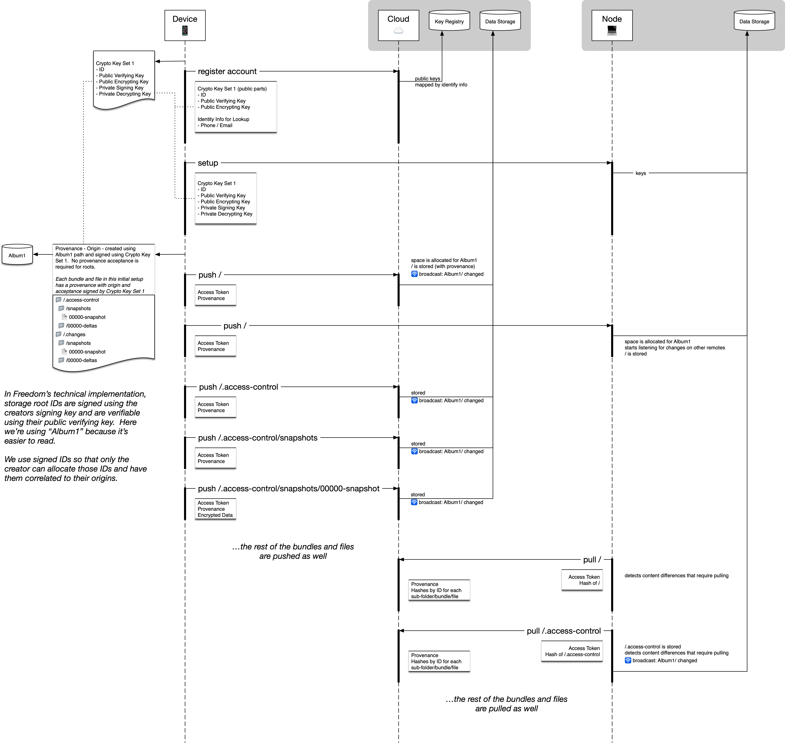

# Freedom Syncable Items

## Shared types for encrypted, sharable data

These data are modeled in a file-system like manner and meant to be stored in memory, on disk, or in a DB. They are designed to be used asynchronously, in parallel, and by multiple users, in an eventually consistent manner.

There are three primitive types:

- folder - may contain other folders, bundles, and files. Each folder is independently sharable. Sharing a parent folder doesn't automatically give access to sub-folders.  
- bundle - may contain other bundles and files. Bundles, unlike folders, do not have their own sharing capabilities. They are shared as part of whatever parent folder they're in.  
- (flat) file - Contain binary data. These are immutable and are shared as part of whatever parent folder they're in.

## Encryption

Most files are signed and entirely encrypted, so their contents are unreadable by Freedom or anyone else without the necessary keys. This includes all API-created files. Important details on sharing and multi-user encryption are discussed later.

Most folder, bundle, and file names are also encrypted.

### Special Bundles

There are two special bundles, per root / folder, whose contents aren't encrypted at the top level, which are used to help with data access and data management. These aren't encrypted at the top level, but changes to these documents must be signed and they're append-only.

- `.access-control` - role / access information\* and encrypted shared keys (secret keys are encrypted per user with read access)  
- `.changes` - information about deletions

\* This is temporary. We are working on a spec that uses the [Signal Private Group System](https://signal.org/blog/signal-private-group-system/) with an enhancement that uses a blockchain to store the group lists instead of a central server.

## Access Control

Each folder has a special "access control" bundle, which isn't encrypted at the top level -- though individual elements within the bundle are signed and/or encrypted.

Access control bundles are documents, encoded, using multiple sub-bundles and files, as conflict free resolution data types (CRDTs).

Each access control document has an initial access state, which is signed by the creator of the document.  All folders, bundles, and files within a root should be accessible by the root creator, otherwise they will be rejected.

### Roles

Syncable stores support 5 roles:

- creator  
  - cannot be removed or modified. There is exactly one creator per root.  
  - can add or remove users of any type (except creator)  
  - can read, write, and delete bundles and flat files  
  - can read, create, and delete folders  
  - can accept or reject changes  
- owner  
  - can add or remove users of any type, other than creator  
  - can read, write, and delete bundles and flat files  
  - can read, create, and delete folders  
  - can accept or reject most changes (except for things owners cant do)  
- admin  
  - can add or remove editors and viewers  
  - can read, write, and delete most bundles and flat files  
  - can read, create, and delete folders  
- editor  
  - can read folders  
  - can read and and write most bundles and flat files  
- viewer  
  - can read folders, bundles, and flat files
- appender
  - can create bundles and flat files, but not read

App-specific semantics may also be enforced for these roles. If different roles are desired for an app's purposes, those can be modeled and managed in parallel to these rules and enforced in software, using similar techniques. However, all Cloud-based enforcement, which grants basic read/write access, will be managed with the above roles.  

---

Changes to access control documents are made by appending signed changes. Any user with write access may attempt to make changes, but disallowed changes will be rejected by synchronizing servers and by end user apps and devices. In order to ensure that access control changes are validated in a roughly linear order, the changes files are named using timestamps signed by a trusted time source, which could be a Freedom Cloud or Node, for example. Root creators are also always considered as trusted time sources and will sign their own timestamps offline.

There are three types of access control changes: add, remove, and modify. For a change to be accepted, the signing user must have the correct privilege to make the requested change. Conflicts will be resolved automatically using usual CRDT resolution and there are cases where wildly out-of-sync access control changes could lead to interesting / confusing results, but they will at least be consistent. Access control merging is additionally discussed in an appendix section.

_Note: in the future, especially to support app-specific permissions modeling, custom bundles will be flaggable as append-only, which will then disallow deletion options within the bundle._

## Sharing

Access control documents contain a set of shared keys, where the private keys are encrypted for each member with read access.  The most recent shared keys should typically be used, so that users who have been removed, won't be able to read new data.

When new users are added, all of the previous secrets are encrypted for the new user and added to the document.

When users are removed, a new secret is generated and encrypted for all remaining members. It's up to apps to decide if and when to reencrypt old data using new keys, which can be expensive both in terms of bandwidth and computation.

_// TODO: support reencryption in code_

Each user has a main key set, which includes public keys for encrypting data and verifying signatures and private keys for decrypting data and generating signatures. Freedom offers a registry for looking these public keys up using other information, like phone numbers, but public keys can also be exchanged and verified through external channels. Apps will offer mechanisms so users can correlate the public keys they know about with the public keys on actual owner devices (ex. one could look at another user's app screen to see the checksum of their own public key vs the checksum of their same public key on your own device).

### Secrets

Shared secrets are actually 4096-bit RSA-OAEP keys using SHA-256 hashing where the private key is encrypted such that only the associated member can decrypt it.

## Reading

Data read protection is managed in two ways:

- access to the actual bits of the (encrypted) data  
- the ability to decrypt the data

When accessing remotes (e.g. Freedom cloud services or Freedom Nodes) to read or write data in a shared folder, one sends a signed token with each request. These tokens are checked against the current state of the access control document, and the remote then grants or rejects access to read (or write) bits.

For the portions of data a user wants to read, the user's device must also have the keys to decrypt.  The keys are the shared secret keys that have been encrypted for each member with read access.

Each encrypted piece of data is signed by its author and includes information about how it was encrypted, including a shared key set ID.  Each shared key set has an ID and a map of user public key IDs to encrypted secret keys.  The user decrypts the secret key using their main private key.  Then, they decrypt the data using the secret key.  _We don't directly encrypt the data for each user because that would lead to as many copies of the data as their are members, which would be both space and computationally inefficient, especially for larger data chunks._

_// TODO: add support for optionally downloading metadata only / lazily downloading folders / files / optimizing local file storage_

## Writing

Write protection is managed by remotes in the same way as read protection. Users send a signed token, which is checked against the access control document. Where there is no access control document, only root creators will have sufficient privileges to write.

To write data, one uses the most recent shared keys and then encrypts their new data using that.  There are cases where two or more writers may have out-of-sync ideas about what the most recent share keys are.  These data will be allowed.  However, previously removed users may be able to decrypt these new messages (though they won't be able to obtain their encrypted bits) if they're not reencrypted with later keys.  Additionally, member who have lost read access but have otherwise retained their membership, may be able to read data encrypted using keys they obtained prior to losing their read access.  It is up to apps to manage reencryption.

Apps may provide their own additional semantics with respect to writing, but in general those with write access should be somewhat trusted because a malicious user with write access could cause large amounts of data to be transferred and large amounts of compute to be used up evaluating their content.

If a malicious user with write access is detected by a user with approval privileges, they may be able to:

- Remove the user  
- Reject all of their pending changes

### Provenance

Provenance is metadata that establishes two things: 

- Origin - who created the Item (in a provable way)  
- Acceptance - if the Item was accepted by a high-trust user (so that more extensive checks can be avoided and also for greater stability in the event of possibly delayed merges)

Provenance allows us to prevent a user from writing a file they're not allowed to.

The origin is created from an author-signed hash of the path and contents (for folder-like items, we use the hash of an empty string). Every folder, bundle, and file will have an origin.

An acceptance may be created from a user with accepting privileges using a hash of the path and contents and it includes a trusted time name.  Acceptances are only granted once full evaluation of data is completed by users with accepting privileges (e.g. the most-trusted users).

If a change has an acceptance, only the acceptance is evaluated. If a change doesn't yet have an acceptance, the origin is evaluated and then the specific change may be further evaluated in a context appropriate manner. That is, for access control changes, store changes, or anything else, there may be custom logic to evaluate whether the change was allowed based on the known set of information.

_// TODO: implement accept / reject update mechanisms in code_

## Deletion

All files are immutable and IDs of folders, bundles, and files can't be reused. However, files may be deleted.

Deletions are managed by a separate "store change" CRDT. There's one store change document per folder. To delete a document, a signed change is appended onto the store change document, requesting the deletion.

The folder or file requested for deletion will appear to be immediately deleted, but the underlying data may have a retention period associated with it, in a storage / app-specific manner.

Users without delete access may, in an app-specific way, still virtually delete or request deletions, if the app itself allows. However, the realization and acceptance of such deletions will need to be approved by an owner or admin. For example, if an editor requests deletion in a photo sharing app of their own photo let's say, an owner / admin device could recognize the request and then turn that into an actual delete change – and when such an owner/admin user has an online Freedom Node, this can be near immediate. Freedom won't be able to make these kinds of app-specific determinations because we won't have access to the data to know things like who the original uploader of a photo is, to continue the previous example.

_Note: in the future, we may add undelete support._

## Synchronization

We've casually mentioned "remotes" and "tokens" without really going into what these are.

Remotes are the systems we synchronize with. In the most common cases, these will be a Freedom Cloud and Freedom Nodes. Each sharable folder can be configured, per user, to sync with any number of remotes, in priority order.

On end-user devices, for most changes, synchronization will stop after the first success, for each operation. It's assumed that synchronization between remotes will be faster, less expensive, and/or more reliable than synchronization between end-user devices and remotes. The exceptions to this are:

- for user profile allocation, where the end-user device will push their profile to all of their desired remotes, in order to establish initial access. User profile allocation may also require special authorization per remote.  
- for root allocation. This initial push from a user device to a Node for a root folder is how the Node knows to start syncing it, e.g. with the Cloud.

Since folders and files are immutable, all operations are effectively append-only. We typically use CRDTs where mutability might be required. Even deletions are really an append operation followed by the eventually cleanup of dangling data.

Tokens are really just timestamped data signed with a user's private signing key, which can be validated using their public signature validation key. The exact validity interpretation of a token is up to apps, but generally tokens are valid for a certain amount of time and/or a certain number of uses.

Other than selecting which systems to sync between, and potentially priority order, synchronization and collaboration is automatic.

Within any folder, the synchronization system always syncs in the following order:

1. `.access-control` bundle  
2. `.changes` bundle  
3. all other content

When any data is received, it's validated before it's used. The same validation happens on each remote (if it has decryption access) and end-user device that encounters these changes. For Cloud, which doesn't have decryption access, only read/write level access checks are performed.

### Validation

Validation is generally as follows, stopping if an invalid state is reached:

- If the provenance has an acceptance:  
  - The acceptance is validated  
- Otherwise:  
  - The origin is validated  
  - Context-specific validations are performed

### Configuration

The Freedom Management app will help users to configure the "remotes" they want to synchronize with. This can optionally include the Freedom Cloud and/or Freedom Nodes.  Most users will simply select Freedom Cloud and/or their Freedom Node(s) to enable syncing.  Internally, this configuration is represented by a priority-weighted graph, and advanced users may have more tools for building custom synchronization configurations based on their redundancy needs and optimized for their network topologies.

Each device managed by one's Freedom Management app can be configured per application and/or root, to connect with an arbitrary number of remotes.

### Push Notifications

TBD

## Appendices

### Data Encryption
(moved to [Cryptography](Cryptography.md))

We encrypt data in two different ways, depending on the size of the data being encrypted.

For small data chunks (not more than 446 bytes), we encrypt data using the user's or shared secret private key directly. We currently use 4096-bit RSA-OAEP keys using SHA-256 hashing.

For larger chunks, we use a two-stage encryption where we first encrypt an AES key using the private key and then encrypt the data chunk using the AES key. We include the encrypted AES key in the chunk metadata. AES keys are reused throughout an app's runtime, up to 10000 times, or until they're explicitly rotated.

We include metadata about how each chunk was encrypted, generally including the key ID.

### Folder / Bundle / File Names

IDs used as folder, bundle, or flat file names support 3 encoding modes:

- plain  
- encrypted  
- time

Plain IDs are mainly used for special files that need to be understood by external systems and that don’t give away anything meaningful.  A few examples are: access control bundle IDs, snapshots bundle IDs, and deltas bundle IDs.  General use of plain IDs is available at the API level, but encrypted IDs should be used by default.

Encrypted IDs are strings, encrypted in the same way as file data.  Most IDs should be encrypted.

For cases where time-ordered loading is important, time based IDs can be used.  These aren’t encrypted, but also can’t include inherently meaningful information.  They are composed of an ISO timestamp and UUID.  In most cases, we’ll accept the user’s device time.  When storing changes to access control documents however, timestamps must be generated by a trusted time source.  We call these trusted time names.  Store creators are always trusted and can generate their own trusted time names.  All other users must be online and must access a trusted time source to generate a trusted time name.

### Signatures
(moved to [Freedom Syncable Items](Freedom%20Syncable%20Items.md))

We currently use 4096-bit RSASSA-PKCS1-v1_5 using SHA-256 hashing for signatures.

### CRDT Bundles
(moved to [CRDT](CRDT.md))

Conflict free resolution data types (CRDTs) allow us to merge data from multiple sources without dealing with complex, manual conflict resolution.

We're currently using Yjs to encode our CRDTs and support rich text data and a variety of other complex data types.

For synchronization, we store CRDTs in bundles. CRDT bundles each have at least 2 sub-bundles, representing snapshots and deltas (there's actually a separate deltas sub-bundle per snapshot). Snapshots allow us to flatten and compress data, especially when we know all parties are in-sync. Deltas represent the changes made on top of a given snapshot.

Each saved change is written to a delta file, which can then be synchronized.

### Synchronization with Access Control Change Examples

Let's examine possible synchronization scenarios, especially involving access control changes and 3 hypothetical systems:

- User Device (Device)  
- Freedom Cloud (Cloud)  
- Freedom Node (Node)

#### Creating a User

A user is represented first and foremost by a key set including:

- an ID  
- public verifying key  
- public encrypting key  
- private signing key  
- private decrypting key

The public representation of a user is the ID and public keys.

These keys are created using the users own device and stored and accessed securely.  
Key sets may optionally be registered with the Freedom Cloud or other key registries and associated with lookup information like phone number or email.

To allocate root folders in the Cloud, a Freedom Cloud account will be required, which may have its own user data collection and/or payment method requirements. Cloud use is optional, but when used, the Cloud itself will only have access to the encrypted bits but won't be able to decrypt or inject data.

Freedom Nodes that only have one's public key information can act like the Cloud, acting as a backup-only device. When Nodes have access to private keys, they can act as the associated user, performing complex processing and enrichment tasks and providing custom services. The registration and setup process for Nodes will be managed by Freedom Management apps, but the most essential concept is that keys will be shared from the users device to the Node.

#### Creating a Root

After a new root folder is created locally, it can be registered with the Cloud and/or Nodes. The initial push operations to Cloud or Node register it.

Storage Root IDs include a signature created with the creator's private signing key. A root's provenance always includes an origin, which is also signed using the same key. On remotes, registration authority is established on remotes by:

- Verifying the storage root ID against a previously registered public verifying key  
- Verifying the origin against the same key

If the root already exists on the remote, a "conflict" error will be returned.

After the root is established on a remote using the storage root ID and provenance metadata, the `.access-control` and `.changes` bundles will be synced.  Authority to push these will be established using the creator keys -- no other users will be able to access the content on the remotes until those are at least partially synced.

Once the `.access-control` bundle is loadable, the remote can use it to determine access for non-creator users.

#### Creating Content Locally

Creating sub-folders, bundles, and files locally, is very similar to working with any other file system.  With Freedom however, all API-created content is automatically encrypted on write and decrypted on read, using the shared secret keys in the access control document, which is available with each folder.

Once configurations are setup with Cloud and/or Nodes, synchronization happens automatically. We use push and pull operations, hierarchically comparing hashes, to determine what is out of sync.

The hash of a folder or bundle is a hash of the map of IDs to hashes of items directly contained in that folder/bundle. The hash of a flat file is just the SHA256 hash of its binary contents.

#### Sharing with Another User

To share data with another user, potentially for collaboration, one makes a change to the access control document for the folder that one wants to share.

To do that, one must get the public verifying and encryption keys for the new user – using a key registry or through an external channel.

When adding another user, one:

- appends an add-access change to the access control document  
- if the new user has read access:
  - encrypts all of the shared secret keys from the access control document for the new user, using their public encryption key

Once these changes are synced with the relevant remotes, the remotes will be able to grant access to the new user, who will generate access tokens signed with their public signing key, and which will be checked against the access control document.

#### Another User Syncing with Cloud

If a new user is granted write access, they will be able to add new files to the system. Unless the user is established as a highly trusted user, they won't have approval access, so their changes will require evaluation before they are approved.  
